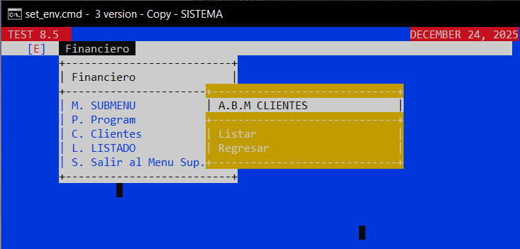

```
cobc -x -free menu.cbl
cobc -x -free MENU3.cbl CLIENTES-PROGRAM.cbl CLIENTES.cbl -o sistema.exec
```

ARCHIVOS COBOL
.CPY	
.FD	
.SEL

- ORDEN CORRECTO
  
  C:\GC32\COBOL
 ├── SRC   ← programas COBOL (.cob)
 ├── CPY   ← copybooks (.cpy)
 ├── DAT   ← archivos de datos (.dat, .idx)
 ├── OBJ   ← objetos intermedios (opcional)
 └── BIN   ← ejecutables (.exe)


:: por jose daniel JDGO
set COB_SCREEN_EXCEPTIONS=Y
set COB_COPY_DIR=C:\GC32\cobol\CPY

:: new cmd to stay open if not started directly from cmd.exe window

Color	Código
Negro	 0
Azul	 1
Verde	 2
Cian	 3
Rojo	 4
Magenta	 5
Amarillo 6
Blanco	 7

- EJEMPLOS DE COPYBOOKS (.CPY)
   78 COLOR-ROJO  VALUE 4.
   

*> CODIGOS DE TECLAS (GnuCOBOL / Windows)
78 TECLA-ENTER      VALUE 0.
78 TECLA-ARRIBA     VALUE 2003.
78 TECLA-ABAJO      VALUE 2004.
78 TECLA-IZQUIERDA  VALUE 2001.
78 TECLA-DERECHA    VALUE 2002.
